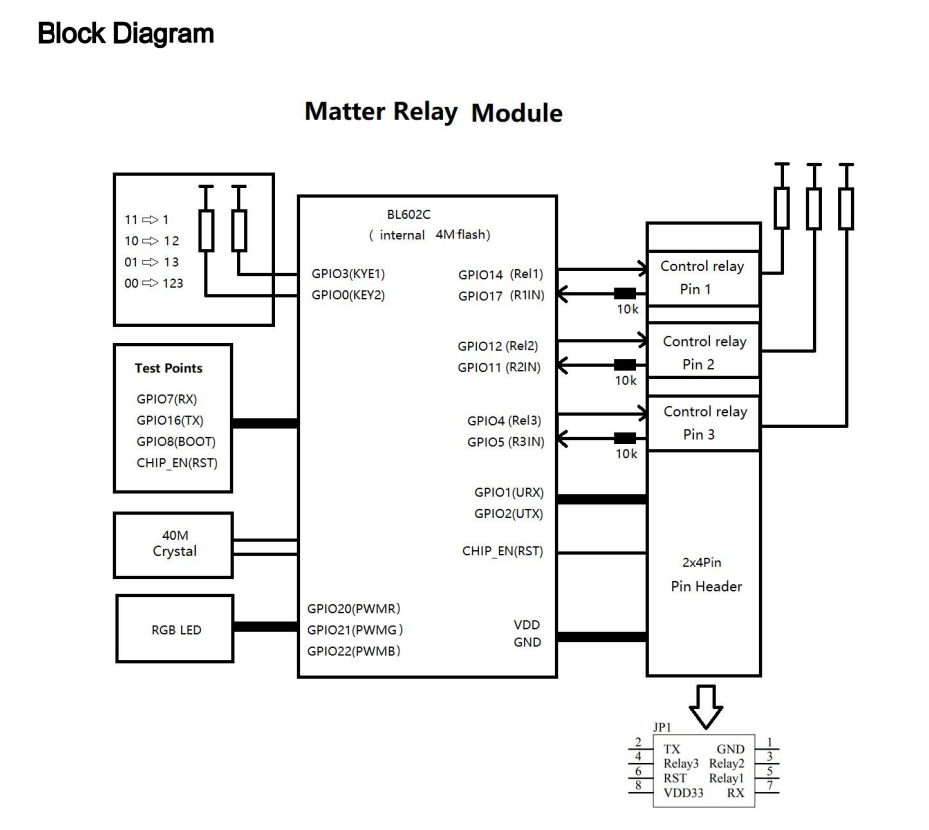
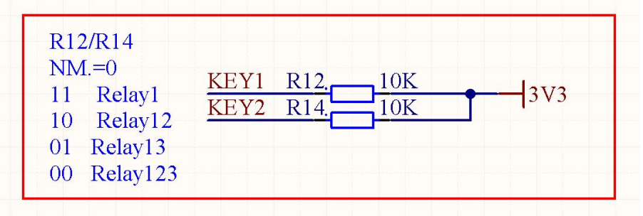
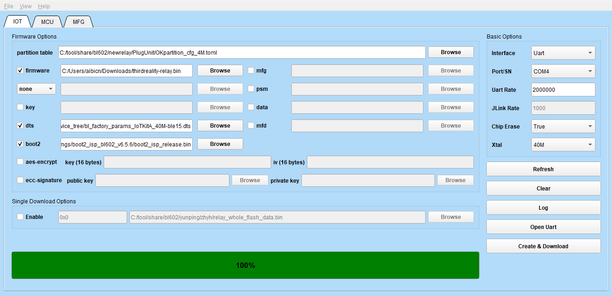

# ThirdReality Relay Module

The relay module supports Matter protocols, is suitable for power switch control scenarios in various circuits. You can use any app that supports Matter, such as Amazon Alexa, Apple Home, Google Home, SmartThings , ThirdReality app or Matter Chip-Tool to communicate with the Module. Simultaneously utilizing various intelligent speakers, such as HomePod/mini, Google Nest/Display, Amazon Echo/Dot,  you can also easily control the Relay through voice interaction.

The relay module has passed CSA Matter 1.1 certification，RF and other hardware indicators certification, ensuring its safety. It is small enough in size to easily embed into your product, allowing it to immediately integrate into the Matter ecosystem. The standard OTA upgrade of Matter can continuously ensure that your relay firmware updates are synchronized with Matter upgrades.

A single module supports up to 3 independent relay controls, and this configuration on the module can be changed through four combinations of two resistors. Then, the pre burned firmware will recognize the hardware changes and complete the dynamic configuration.


# Hardware Scheme






**Hardware Configuration Options**

- *both R12 and R14 welded, only Relay 1 installed*
- *only  R12  welded, Relay 1 & 2 installed*
- *only  R14  welded, Relay 1 & 3 installed*
- *neither R12 nor R14 welded, Relay 1 & 2 & 3 installed*


# Development Environment

## Recommended OS

`Ubuntu` 22.04 LTS

## Install Dependencies

`sudo apt-get install git gcc g++ pkg-config libssl-dev libdbus-1-dev \`

​     `libglib2.0-dev libavahi-client-dev ninja-build python3-venv python3-dev \`

​    `python3-pip unzip libgirepository1.0-dev libcairo2-dev libreadline-dev`

## Download Code

`git clone https://github.com/thirdreality/relay_mt.git`

`cd relay_mt`

`git submodule update --init --recursive`

`source ./scripts/activate.sh`

If this script says the environment is out of date, it can be updated by running:
`source ./scripts/bootstrap.sh` 

## Install Bouffalo Lab SDK

`cd third_party/bouffalolab/repo`

`sudo bash scripts/setup.sh`

## Set Environment Variables

`export BOUFFALOLAB_SDK_ROOT=/opt/bouffalolab_sdk`

## Compile Relay Code (main branch)

`./scripts/build/build_examples.py --target thirdreality-relay-light build`

## Compiled Results

at ./out/thirdreality-relay-light/ directory

You can find the 'thirdreality-relay. bin' file there, and then you can burn the bin file to the device.


# Burn Firmware

## Get Burning Tool

The burning tool "**Bouffalo Lab Dev Cube**" can be downloaded from the bouffalo official website 

https://dev.bouffalolab.com/download


## Connect the relay module to a USB to UART board

| PIN (relay module) | PIN (USB to UART board) |
| ------------------ | ----------------------- |
| V                  | VCC (3.3V)              |
| G                  | GND                     |
| RX                 | TXD                     |
| TX                 | RXD                     |

The hardware wiring can refer to the following diagram


## Connect UART board to computer USB port

Set serial port parameters as the following


***Pay attention to serial port baudrate 2000000***


## Burning Process

1. Connect the relay module GPIO8(Boot)  to 3.3V pin on the UART board,  power on relay

2. Copy the previously compiled bin file "thirdreality-relay. bin"

3. run BLDevCube.exe ( at burning tool directory ) on Windows OS

4. Set parameters as shown in the following screenshot 

   ```
   You can get partition table file from this repository, relay_mt/tools-3r/firmware/bl602/,
   
   dts and boot2 from the burning tool,
   
   firmware from the build.
   ```

   

5. click Create & Download button

6. wait until the progress bar is 100%, which means the burning is completed

   




## Get QR code

After burning reset relay, from the uart log, copy URL similar to the following:
https://project-chip.github.io/connectedhomeip/qrcode.html?data=MT%3A-24J0-C714W80648G00

Open the URL above with a browser, and normally, there will be a QR code on the screen


# Control Relay


## Plug into the smart socket ESP-01S Relay base

The Relay module can be directly plugged into the ESP-01S relay smart socket, which is powered by 5V DC, then  you can experience pin to pin compatibility and immediately work.


## Example of Controlling the Relay with an APP

Taking an Apple phone as an example, you can do as follows

1. Open the mobile phone Home App, click the "+" in the upper right corner, and select "Add accessories" from the pop-up menu.

2. Scan the QR code above on the pop-up interface, and add it according to the prompts. You can customize the location and name of the accessories at Home.

3. Wait for the configuration to be completed, and there will be a new relay device in Home.

4. You can open the accessories interface to control the relay module on iPhone, or control the relay through voice interaction, such as "turn on BB2".

   

   


# More references for relay control


## Use iPhone and HomePod mini

### Prepare

Upgrade the iPhone OS to 16.5.1 or higher

Confirm that the App Home is installed on your phone

Upgrade HomePod to version 16.5.1 or above

### Reset Apple HomePod

Power on the loudspeaker after power off for 10s

Wait for 5s after power on, you may press the center at the top of the speaker with your index finger

Release after you hear 3 beeps, according to the speaker prompts, and there will be a chime


### Bind iPhone and HomePod

1. Plug the HomePod mini or HomePod into the power supply. Wait for the prompt sound and the indicator on the HomePod mini or the top of the HomePod starts flashing white.
2. Unlock your iPhone or iPad and place it close to the HomePod mini or HomePod. When "Settings" appears on the device screen, tap this button.
3. When the system prompts you to place the HomePod mini or HomePod in the center of the iPhone or iPad viewfinder, follow the prompts to complete pairing. If you can't use the camera, please click "Enter password manually", and Siri will respond with a four digit password. Please enter this password into your device.
4. Follow the onscreen instructions to select your settings. After setting up, you can also customize and manage all the HomePod mini or HomePod settings in the Home app.
5. Wait for HomePod mini or HomePod to finish setting, then tap Finish.


### Add a Relay Module in Home

1. Power on the relay  ( If the following steps are not successful and exceed 10 minutes, power up the Relay again ).

2. Open the URL (as a developer you may copy it from uart log) with a browser, and normally, there will be a QR code on the screen.

3. Open the mobile phone Apple Home App, click the "+" in the upper right corner, and select "Add accessories" from the pop-up menu.

4. Scan the QR code, which either can be opened with a browser(see step 2)  or has been printed and pasted on the shielding cover of the module.

4. Add the relay device according to the prompts. You can customize the location, name or icon of the accessories in Home App.

    

    *Different display icons can be selected*

    

5. Wait for the configuration to be completed, and there will be a new device in the Home.

6. You can operate in the Home App to control the relay on/off through touch, or control it through voice interaction, such as "turn on XXX (the relay device name)".

    

    *If the relay is turned on, the LED green light will be on; If the relay is disconnected, the LED light will go out.*

    


### Remove Accessories from Apple Home

Open the Home App and enter "My Home"

Tap the accessory to be deleted to open the accessory details page

Slide the screen to the bottom, select "Remove accessories", and confirm

For HomePod, select "Restore HomePod..." and then "Remove Accessories"


## Use Android Phone and Google Nest

### Reset Google Nest

If the device has been used before, you can factory reset it as follows:

On the back of the Google Nest Display, press Volume Up and Volume Down simultaneously for 10 seconds.

*(when pressing and holding, a message should appear on the screen telling you about the reset)*

If you are using Google Nest Mini (first generation), you can long press and hold the Reset button at the bottom.

For more details on other Nest speakers, you can refer to the factory instructions for operation.


### Set up Google Nest

Prepare a  Google Nest (speaker or display)

Open the Google Home App (upgrade to the latest version first) on your mobile phone

Recommended to set Google Nest as the first device

Tap "Device" on the bottom menu bar

Tap the “+ Add device” icon, Set up a device (set up a new device or add an existing device or service to your home)

Choose a home (you will be able to control the devices and services in this home) , then tap Next, Enter Looking for devices.. or Choose Add another home, then tap Next, enter a Home nickname and address

Wait a moment till you see " Nest Hub found" result text, then Scan the QR code on the Google Nest screen

Configure the device as required until “XXX display is ready “ is displayed

*(XXX is the name of the room where the device is set earlier)*

Complete the setting of Google Nest


### Add a Relay Module in Google Home

Similar to adding Google Nest above, you can add a relay modulet in Google Home as follows:

Tap "Device" on the bottom menu bar

Tap the + Add icon, Set up a device (set up a new device or add an existing device or service to your home)

Choose "New device" item, Choose a home on next screen, then tap Next, Enter Looking for devices...

on next screen, What are you setting up?

select and tap Matter-enabled device, then enter next screen, Scan Matter QR code

Connect this device to your Google Account, tap "I agree" On the bottom right screen, then Connecting device to Google Home...

Wait a moment when you see "Device connected", then tap Done, in your home you can find a new device, you can change its name in the settings (tap Gear icon in the upper right corner)


## Use Android Phone and Echo V4

Matter-enabled Amazon Echo devices have built-in software to connect and control Matter smart home devices seamlessly. After a customer sets up an Echo, you can connect their devices by saying, "Alexa, discover my devices", or if you like, by adding the device in the Alexa app as follows: 


1. Install Amazon Alexa app on Android mobile phone

2. Set up your Echo speaker according to instructions

3. Open the Alexa app and enter "Device Settings" screen

4. Tap the + sign in the upper right corner to select "Add Device" from the pop-up screen

5. Enter the next screen SETUP and select "Connect your Matter Device"

   "Control your Matter device with Alexa", Next

   "Does your device have a Matter logo ?", Yes

6. "Locate a QR code shown for your device", tap "Scan Qr Code" at the bottom of the screen

7. "Allow Permission:  Bluetooth, Camera", Next 

8. "Allow Amazon Alexa to take pictures and record video ?"

   select "While using the app", then Scan the QR code for Matter Device

   Enter "Looking for your device" screen, wait a moment

   when you see "Connect device to Wi-Fi" select the hotspot your phone is using

9. "Device found and connected", tap "Done"

10.  You can control the relay module added above, or voice control lights

    

# OTA upgrade with ThirdReality App

### Install ThirdReality App

(url to download)

Prepare an Android 8.0 or higher phone to install ThirdReality App - app-release.apk


### Control the Relay Module

Using the App to add a device, click on the + icon in the upper right corner of the screen

*(If first time you use the App, click Allow permission)*

Scan the QR code of the relay module and add it to the App


### OTA upgrade

Click the Device icon, open next screen

If you see "There is a new version available to update",  Click Download and Install to launch OTA upgrade


# Factory Reset

1. Quickly switch and power on 7 times, with an interval of no more than 4 seconds, and then the module will Factory Reset.
2. During the process the light will go out, and then the brighter red light will light up for half a second, indicating that factory reset start.
3. Afterwards, the module will automatically start.
4. If the relay was previously connected to a WiFi, the blue light will remain on after Factory Reset; Otherwise, the blue light will be blinking at one second intervals.
